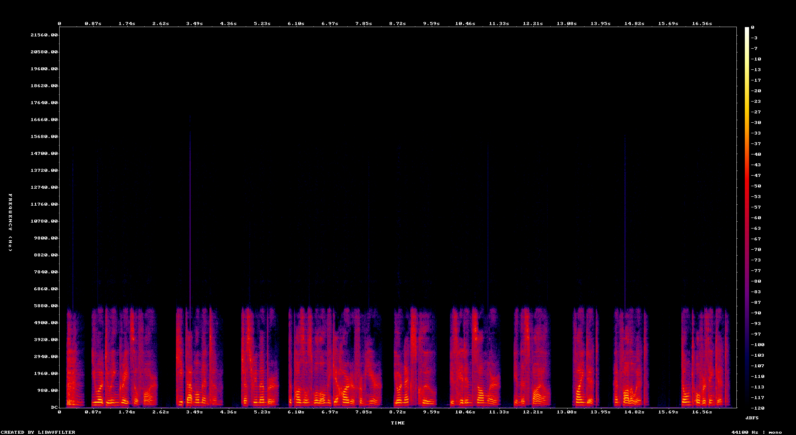
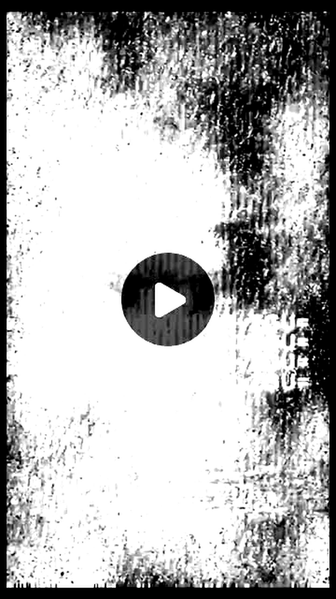
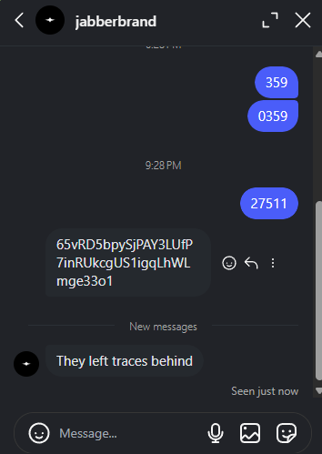
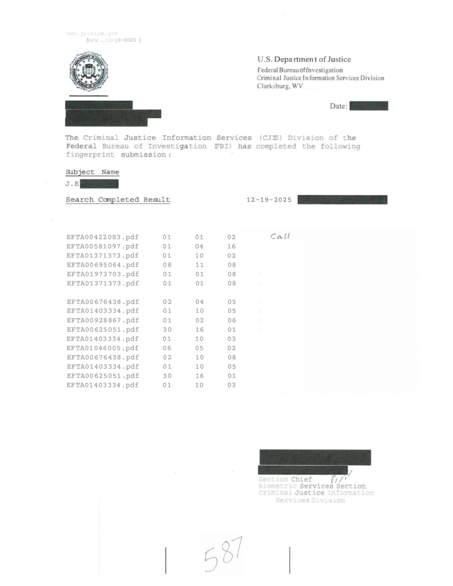
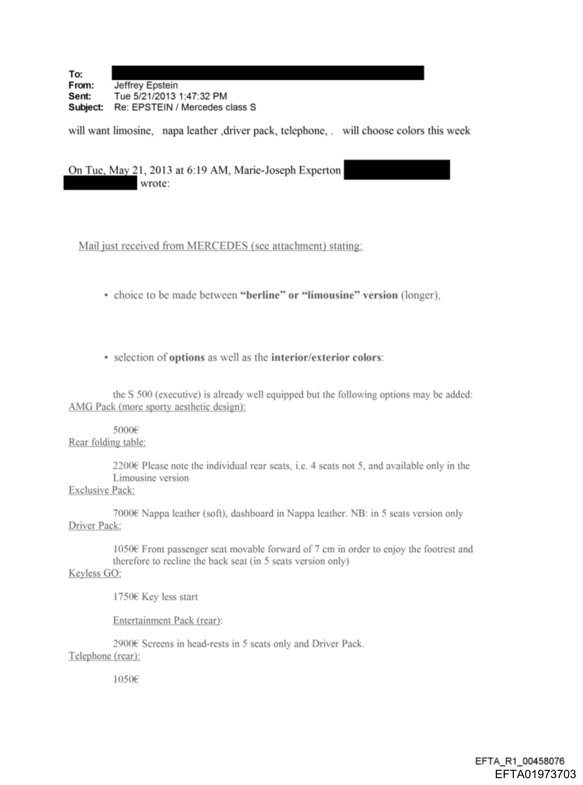
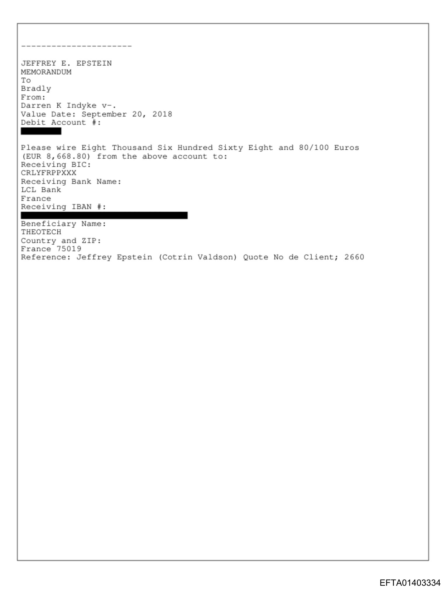
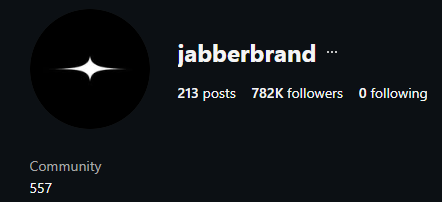
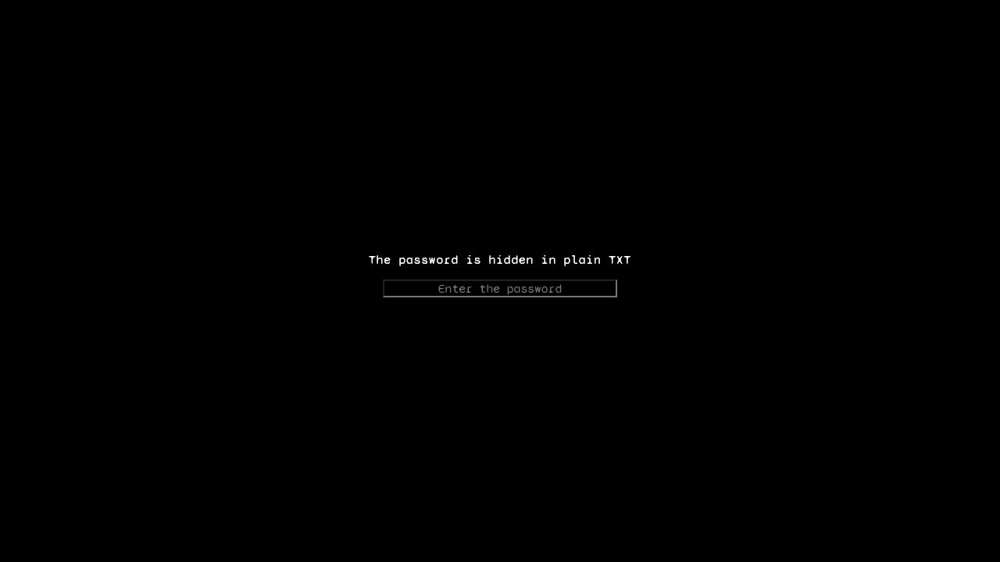

# Wallet 1 - Key 01 / Fragment 1

Status: solved and verified

Primary clue: `Clues/Clue-1.mp4`

## Fragment

```text
FbAbj+tCJ/7qpgm8E4NtOHonZTD5jK6OZXwcKK0rGsiSnC0ZtzqwSZpFuzmHhcJ97fhNVhby
```

## Short Chain

```text
Clue-1.mp4
-> Morse audio
-> CICADA3301.NETWORK/
-> cicada3301.network root page
-> duo.html
-> hidden Latin: "the next step is in page VII"
-> septem.html
-> 359.mp3
-> Instagram URL in 359.mp3 metadata
-> Instagram Base64 prompt: "DM me the code"
-> audio code 27511
-> DM response with Solana address
-> Solana trace to token metadata
-> token symbol ATBASH
-> Atbash-decoded media URL
-> OutGuess payload
-> Caesar -4 URL
-> J.E.bookcipher.pdf
-> EFTA book cipher
-> phone number 3618801688
-> phone clue triggers a six-prime audit of earlier artifacts
-> 3618803301.xyz
-> DNS TXT password
-> AES-GCM page payload
-> Key 01 fragment
```

## Step 1 - Decode The Morse Video

What we were given:

```text
Wallet-1/Key_01/Clues/Clue-1.mp4
```

The MP4 behaves like an audio clue. Its audio contains clean short and long
pulses, which makes Morse the least speculative first read.

Reproduction from the repository root:

```powershell
python tools\wallet1_key01_extract.py --ffmpeg <path-to-ffmpeg>
```

Expected output:

```text
key_01_clue_1_morse=-.-. .. -.-. .- -.. .- ...-- ...-- ----- .---- .-.-.- -. . - .-- --- .-. -.- -..-.
key_01_clue_1_text=CICADA3301.NETWORK/
```

Result:

```text
CICADA3301.NETWORK/
```

Why it mattered:

The output is a direct domain clue. The trailing slash and full domain shape make
it more useful as a URL than as text to keep ciphering.

## Step 2 - Follow The Latin Page Path

Opening the Morse-derived site root did not reveal a fragment. It pointed to:

```text
duo.html
```

Inspecting `duo.html` revealed a hidden line:

```text
Gradus proximus est in pagina VII
```

The Latin translates to:

```text
The next step is in page VII.
```

Because the site was already using a Latin page name, `duo`, page VII naturally
mapped to the Latin `septem`.

Concrete path:

```text
https://www.cicada3301.network/
-> https://www.cicada3301.network/duo.html
-> https://www.cicada3301.network/septem.html
```

The `septem.html` page exposed:

```text
https://media.cicada3301.net/audio/359.mp3
```

Why it mattered:

This turned a website clue into a new concrete media artifact to inspect.



## Step 3 - Inspect `359.mp3`

Inspecting the media metadata revealed:

```text
WOAR: https://www.instagram.com/p/DZ-iNbYNZQZ/
```

Reproduction:

```powershell
ffmpeg -hide_banner -i 359.mp3
```

The important field was the Instagram URL:

```text
https://www.instagram.com/p/DZ-iNbYNZQZ/
```

Why it mattered:

The Instagram URL was embedded in clue-derived media metadata, so following it
was a direct continuation of the chain, not a guess.

## Step 4 - Read The Instagram Prompt

The Instagram clue contained this Base64 text:

```text
RE0gbWUgdGhlIGNvZGU=
```

Decoding it:

```powershell
[Text.Encoding]::UTF8.GetString([Convert]::FromBase64String("RE0gbWUgdGhlIGNvZGU="))
```

Output:

```text
DM me the code
```



Listening to the reel audio in reverse identified the working code:

```text
27511
```

Why it mattered:

The Base64 gave the action, and the reel audio supplied the code. This moved the
chain from a public clue surface into a response from the clue account.

## Step 5 - Confirm The DM Response

After sending:

```text
27511
```

The clue account responded:

```text
65vRD5bpySjPAY3LUfP7inRUkcgUS1igqLhWLmge33o1
They left traces behind
```



The first line is valid Base58 and has the shape of a Solana public key. The
phrase "They left traces behind" told us what to do with it: inspect its
on-chain activity rather than try to decrypt the address itself.

Expected check:

```text
decoded length: 32 bytes
chain: Solana account/public-key-shaped value
```

## Step 6 - Follow The Solana Trace

Address from the DM:

```text
65vRD5bpySjPAY3LUfP7inRUkcgUS1igqLhWLmge33o1
```

Read-only Solana inspection showed finalized activity leading to a pump-style
token mint:

```text
mint: GDVmyZQtc84T3L9WDwhR1VucEszomtUZWVQiq23Bpump
symbol: ATBASH
```

Why it mattered:

`ATBASH` names the next transform.

## Step 7 - Decode The Atbash Metadata

The token metadata description was:

```text
nvwrz wlg xrxzwz3301 wlg mvg hozhs rnt hozhs 024uz91v-5v25-42xu-zxvw-9842216zu8u8 wlg qkt
```

Since the token symbol was `ATBASH`, applying Atbash was directly instructed.

Reproduction:

```powershell
@'
text = "nvwrz wlg xrxzwz3301 wlg mvg hozhs rnt hozhs 024uz91v-5v25-42xu-zxvw-9842216zu8u8 wlg qkt"
alpha = "abcdefghijklmnopqrstuvwxyz"
table = str.maketrans(alpha, alpha[::-1])
print(text.translate(table))
'@ | python -
```

Output:

```text
media dot cicada3301 dot net slash img slash 024fa91e-5e25-42cf-aced-9842216af8f8 dot jpg
```

Normalized:

```text
https://media.cicada3301.net/img/024fa91e-5e25-42cf-aced-9842216af8f8.jpg
```


Why it mattered:

The transform was named by the token itself and produced another URL on the same
clue media host.

## Step 8 - Extract The OutGuess Payload

The image visibly says:

```text
Remember me?
```

Its metadata gave the real instruction:

```text
Looks like you can't Guess how to get the message Out.
```

The capitalized words point to OutGuess.

Reproduction:

```powershell
outguess -r atbash-image.jpg out_01.txt
Get-Content out_01.txt
```

Output:

```text
TIBERIUS CLAUDIUS CAESAR says: lxxtw://qihme.gmgehe3301.rix/29f356h4-g345/N.I.fssogmtliv.thj
```

Why it mattered:

The payload names Caesar, so the encoded URL should be tested as a Caesar
shift rather than as arbitrary substitution text.

## Step 9 - Apply The Caesar Shift

Payload:

```text
lxxtw://qihme.gmgehe3301.rix/29f356h4-g345/N.I.fssogmtliv.thj
```

`TIBERIUS CLAUDIUS CAESAR` points to a Caesar shift. Testing the shift that
turns URL-like text into a valid clue-hosted URL gives `-4`.

Reproduction:

```powershell
@'
text = "lxxtw://qihme.gmgehe3301.rix/29f356h4-g345/N.I.fssogmtliv.thj"
out = []
for ch in text:
    if "a" <= ch <= "z":
        out.append(chr((ord(ch) - ord("a") - 4) % 26 + ord("a")))
    elif "A" <= ch <= "Z":
        out.append(chr((ord(ch) - ord("A") - 4) % 26 + ord("A")))
    else:
        out.append(ch)
print("".join(out))
'@ | python -
```

Output:

```text
https://media.cicada3301.net/29b356d4-c345/J.E.bookcipher.pdf
```

Why it mattered:

The filename says `bookcipher`, so the next artifact described how it should be
read.

## Step 10 - Read The Book-Cipher PDF

The PDF contained EFTA document references, coordinate triples, and a handwritten
instruction:

```text
Call
```



The coordinate triples pointed into EFTA source documents. Some referenced Bates
numbers live inside larger PDF ranges, so the containing PDFs had to be opened
at the correct page before counting visible lines and words.

Example coordinate format:

```text
EFTA01973703.pdf 01 01 08
EFTA01403334.pdf 01 10 05
```

Expected selected wording:

```text
telephone
three six one double eight oh one six double eight
```

Those words produce:

```text
3618801688
```





Why it mattered:

The PDF did not merely contain a number. It told us to call that number.

## Step 11 - Use The Phone Clue

The phone recording said:

```text
6 prime numbers were hidden in earlier challenges. You probably noticed them,
but their purpose may not have been clear. Calculate the sum of this phone
number plus those 6 prime numbers then add ".xyz" at the end
to find the next step. Good luck.
```

This was the first point where the puzzle gave any reason to audit earlier
artifacts for numbers. Only now did the six values become relevant. Backtracking
through the completed clue path revealed:

```text
2       duo.html title/page number
7       septem.html title/page number
359     page 7 audio filename/metadata
101     Solana token name
557     jabberbrand Instagram bio
587     handwritten number on the book-cipher PDF
```



Prime set:

```text
2, 7, 101, 359, 557, 587
```

Reproduction:

```powershell
$phone = 3618801688
$primes = 2,7,101,359,557,587
$sum = ($primes | Measure-Object -Sum).Sum
"$phone + $sum = $($phone + $sum)"
```

Output:

```text
3618801688 + 1613 = 3618803301
```

Resulting domain:

```text
https://3618803301.xyz/
```

Why it mattered:

The arithmetic result resolved as a real domain and preserved the `3301`
signature in the final digits.

## Step 12 - Use The DNS TXT Password

The page said:

```text
The password is hidden in plain TXT
```



That points to DNS TXT records, not page text or image metadata.

Reproduction:

```powershell
nslookup -type=txt 3618803301.xyz 1.1.1.1
```

TXT record:

```text
f05d7d59ebadb5516d65bfeb7b987b5bab8f8249377d70329bbf080006039511
```

Why it mattered:

The value is exactly 64 hex characters, so it can be used as a raw AES-256 key.
The password page JavaScript accepted either a passphrase-derived key or a raw
64-hex key; this value matched the raw-key branch exactly.

## Step 13 - Decrypt The Page Payload

The page stored a Base64 AES-GCM payload in JavaScript. For a raw 64-hex key,
the payload format was:

```text
first 12 bytes: IV
middle bytes: ciphertext
last 16 bytes: authentication tag
```

Reproduction shape:

```powershell
@'
const crypto = require("crypto");
const keyHex = "f05d7d59ebadb5516d65bfeb7b987b5bab8f8249377d70329bbf080006039511";
const cipherB64 = "<page CIPHER value>";
const combined = Buffer.from(cipherB64, "base64");
const iv = combined.subarray(0, 12);
const encWithTag = combined.subarray(12);
const ciphertext = encWithTag.subarray(0, encWithTag.length - 16);
const tag = encWithTag.subarray(encWithTag.length - 16);
const decipher = crypto.createDecipheriv("aes-256-gcm", Buffer.from(keyHex, "hex"), iv);
decipher.setAuthTag(tag);
console.log(Buffer.concat([decipher.update(ciphertext), decipher.final()]).toString("utf8"));
'@ | node -
```

Output:

```text
FbAbj+tCJ/7qpgm8E4NtOHonZTD5jK6OZXwcKK0rGsiSnC0ZtzqwSZpFuzmHhcJ97fhNVhby
```

Why it mattered:

This produced the Wallet 1 Key 01 fragment.

## Step 14 - Ignore The Congratulations Audio As A Branch

The same password page also contained an encrypted audio path. Decrypting it
with the same DNS TXT key produced:

```text
94b48e4f-070a-49e0-8c57-71edbb4cce3e.mp3
```

The page source described the audio as a message shown after the correct
password, not as a clue. We treated it as confirmation of the password, not as a
new branch.

## Validation

The fragment was submitted to the official Wallet Decryption page and accepted
as verified.
