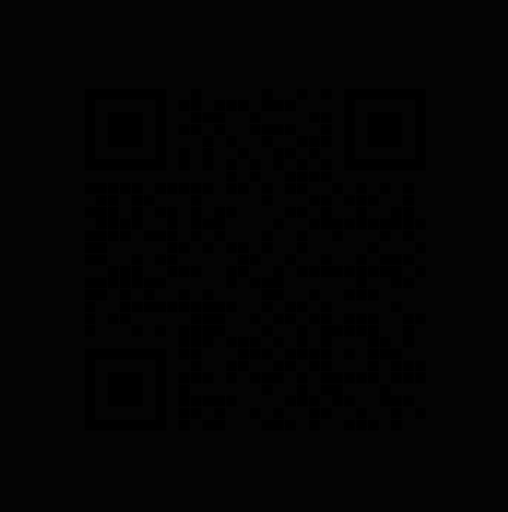

# Wallet 1 - Key 02 / Fragment 2

Status: solved and verified

Primary clues:

```text
Clues/Clue-1.png
Clues/Clue-2.mp4
```

## Fragment

```text
xYvABnPrEsQCskQ7+SrgqPRRevSH9LWAl73QcJUu3/0znZDtheYZ05Ly/lvR0aj/l0+776kR3cNRm91POkR8Kme0Nn4gxo7GKV7b2jY2ZYV/aey0aMr5J+98N2Y0YT5v42RltotHFiFsP8h/hKmm2w1JG5xCwEoH8AEsRq8HXJd6DCvFHYJoni70W15zwLTgyvE/xumXzqQfu7wPLzCvAkqgigPvDj6dth/Weu/ste+6d15x
```

## Short Chain

```text
Clue-1.png
-> dark QR
-> threshold QR image
-> payload: 3 -> zzzgrwagrwfrpvodvk0e887ifehh9042
-> ROT -3
-> www dot x dot com slash 0b887fcbee9042
-> X profile: 0b887fcbee9042
-> display name "homo"
-> homophonic substitution using profile post groups
-> IN THE PAGE TWENTY YOU SHALL FIND YOUR WAY
-> cicada3301.network/viginti
-> visible 64-hex string
-> countdown-gated video
-> Clue-2.mp4
-> reversed audio
-> hash belongs to an image
-> hash-named PNG on media.cicada3301.net
-> 6x6 RGB tile grid
-> RGB triplets decode ASCII
-> hash is password for CIPHER2 on 3618803301.xyz
-> Key 02 fragment
```

## Step 1 - Decode The Dark QR

What we were given:

```text
Wallet-1/Key_02/Clues/Clue-1.png
```

The image looked almost completely black, but QR finder patterns were faintly
visible. That made "low contrast QR code" the first concrete hypothesis.



A normal scan did not read it reliably, so the image was preprocessed:

1. Convert the image to grayscale.
2. Treat grayscale values at `1` or below as black.
3. Treat all other pixels as white.
4. Add a white quiet-zone border.
5. Scale with nearest-neighbor interpolation.
6. Run QR decode again.


Reproduction from the repository root:

```powershell
python tools\wallet1_key01_extract.py --ffmpeg <path-to-ffmpeg>
```

Expected output:

```text
key_02_clue_1_method=threshold=1
key_02_clue_1_qr_raw=3 -> zzzgrwagrwfrpvodvk0e887ifehh9042
key_02_clue_1_normalized=https://www.x.com/0b887fcbee9042
```

Raw QR payload:

```text
3 -> zzzgrwagrwfrpvodvk0e887ifehh9042
```

Why it mattered:

The payload gave both an instruction (`3 ->`) and encoded text. We preserved the
raw text exactly before applying the transform.

## Step 2 - Apply The `3 ->` Instruction

Input:

```text
3 -> zzzgrwagrwfrpvodvk0e887ifehh9042
```

The payload was not readable as-is. The explicit `3 ->` made a Caesar/ROT shift
the least speculative transform.

Both directions were checked:

```text
ROT +3 -> not useful
ROT -3 -> readable URL words
```

Reproduction:

```powershell
@'
text = "zzzgrwagrwfrpvodvk0e887ifehh9042"
out = []
for ch in text:
    if "a" <= ch <= "z":
        out.append(chr((ord(ch) - ord("a") - 3) % 26 + ord("a")))
    else:
        out.append(ch)
print("".join(out))
'@ | python -
```

Output:

```text
wwwdotxdotcomslash0b887fcbee9042
```

Normalized:

```text
https://www.x.com/0b887fcbee9042
```

Why it mattered:

The QR did not end at a phrase. It pointed to a concrete X profile.

## Step 3 - Inspect The X Profile

What we were given:

```text
https://www.x.com/0b887fcbee9042
```

The profile was sparse. Three observations mattered:

```text
Display name: homo
Bio: numeric groups separated into word-like chunks
Posts: numeric groups that could provide an ordered substitution table
```


Bio text:

```text
02 12 / 06 14 22 / 26 21 17 28 / 96 13 22 12 96 08 / 08 18 16 / 30 14 21 07 42 / 05 41 12 20 / 08 85 94 49 / 13 40 08
```

The display name `homo` pointed to a homophonic substitution: multiple numbers
can represent the same plaintext letter.

The profile's visible post groups supplied the key. X displays newest posts
first, so the newest visible group was treated as `A`, the next as `B`, and so
on through `Z`.

Reproduction:

```powershell
python tools\wallet1_x_cipher_decode.py
```

Output:

```text
newest_first=IN THE PAGE TWENTY YOU SHALL FIND YOUR WAY
oldest_first=RM GSV KZTV GDVMGB BLF HSZOO URMW BLFI DZB
```

Why it mattered:

The newest-first ordering produces clear English, and the oldest-first control
produces nonsense. That makes the post ordering part of the evidence, not an
arbitrary choice.

## Step 4 - Convert "Page Twenty" Into A URL

Decoded instruction:

```text
IN THE PAGE TWENTY YOU SHALL FIND YOUR WAY
```

The phrase gave a page number, not a full URL. The earlier Key 01 site path had
already established a Latin page naming pattern:

```text
duo.html      page 2
septem.html   page 7
```

Page twenty in Latin is:

```text
viginti
```

Both likely forms were checked:

```text
https://www.cicada3301.network/viginti
https://www.cicada3301.network/viginti.html
```

Both returned the same page shape, with title:

```text
Viginti
```

Why it mattered:

The X profile pointed back to the original clue domain and produced a real
page, so the homophonic decode was actionable.

## Step 5 - Inspect The `viginti` Page

The page was minimal. It showed:

```text
Title: Viginti
Image: assets/logo.png
Hex string: ff4b2a38127d919cdfaf3ec81ac67cb11123170c1fc9b483b6475cabe119c0ab
Countdown target in source: 2026-07-06T14:58:58+02:00
```


The important hex string was:

```text
ff4b2a38127d919cdfaf3ec81ac67cb11123170c1fc9b483b6475cabe119c0ab
```

At this stage, the page did not yet provide enough information to honestly
advance. The useful work was limited to:

1. Record the hex string exactly.
2. Record the countdown target.
3. Save the logo/page evidence.
4. Avoid treating the hex string as a hash to brute force without a clue saying
   to do that.

Why it mattered:

This kept the branch from turning into guesswork. The later audio clue
explained what the hex string was for.

## Step 6 - Reverse The New Video Audio

What we were given after the countdown branch advanced:

```text
Wallet-1/Key_02/Clues/Clue-2.mp4
```

The audio sounded reversed. The narrowest transform was to reverse the audio
stream only and leave the original video untouched.

Reproduction:

```powershell
ffmpeg -hide_banner `
  -i Wallet-1\Key_02\Clues\Clue-2.mp4 `
  -vn -af areverse -ac 2 -ar 44100 `
  Wallet-1\Key_02\Clues\Clue-2-reversed-audio.wav -y
```

Expected media characteristics:

```text
Duration: 00:00:25.64
Output: pcm_s16le, 44100 Hz, stereo
```

Reversed audio transcript:

```text
The string has been before your eyes since the beginning.
While you watched the countdown, you searched the wrong direction.
Not every hash is meant to be cracked.
Perhaps it is something to find.
The hash belongs to an image.
Locate the image, and the next clue will reveal itself.
```

Why it mattered:

This corrected the interpretation of the `viginti` hex string. It was not
primarily something to crack. It was something to locate.

## Step 7 - Locate The Hash-Named Image

The audio said:

```text
The hash belongs to an image.
Locate the image.
```

The known clue media host used `/img/` for image artifacts. That made the
direct filename test:

```text
https://media.cicada3301.net/img/ff4b2a38127d919cdfaf3ec81ac67cb11123170c1fc9b483b6475cabe119c0ab.png
```

The URL resolved as a PNG.

Expected observations:

```text
Content-Type: image/png
Size: 300x300
Shape: 6x6 grid of solid color tiles
```


Why it mattered:

The image consisted of 36 tiles. Each tile was a solid RGB color, and each RGB
triplet can be read as three bytes.

## Step 8 - Decode The RGB Tile Grid

The grid is 300x300 pixels, split into 6 rows and 6 columns. Each tile is 50x50
pixels. Sampling the center of each tile avoids border/aliasing concerns.

Reproduction shape:

```powershell
@'
from PIL import Image

im = Image.open("Wallet-1/Key_02/Assets/hash-rgb-grid.png").convert("RGB")
bs = bytearray()

for y in range(6):
    for x in range(6):
        bs.extend(im.getpixel((x * 50 + 25, y * 50 + 25)))

print(bs.rstrip(b"\x00").decode("ascii"))
'@ | python -
```

Output:

```text
the password for the second fragment was infront of your eyes the whole time, find where to put it
```

The spelling `infront` is preserved exactly from the image payload.

Why it mattered:

The decoded text gave two requirements:

```text
Find the password.
Find where to put it.
```

It did not itself claim to be the fragment.

## Step 9 - Identify The Password And The Place To Use It

The phrase "infront of your eyes the whole time" pointed back to the visible
object that had been on the `viginti` page since the start of this branch:

```text
ff4b2a38127d919cdfaf3ec81ac67cb11123170c1fc9b483b6475cabe119c0ab
```

The phrase "find where to put it" pointed back to the password page already
established during Key 01:

```text
https://3618803301.xyz/
```

That page had gained a second encrypted payload:

```text
CIPHER2
```

Obvious shorter candidates such as these did not decrypt the second payload:

```text
3301
homo
viginti
```

The displayed `viginti` hash did decrypt it.

Why it mattered:

The solution reused the earlier password-page mechanism. The second fragment was
not hidden on a new site; it was a second payload on the same password page.

## Step 10 - Decrypt `CIPHER2`

Password/key:

```text
ff4b2a38127d919cdfaf3ec81ac67cb11123170c1fc9b483b6475cabe119c0ab
```

The value is exactly 64 hex characters, so it fits the raw AES-256 key path used
by the password page.

Reproduction shape:

```powershell
@'
const crypto = require("crypto");
const keyHex = "ff4b2a38127d919cdfaf3ec81ac67cb11123170c1fc9b483b6475cabe119c0ab";
const cipherB64 = "<page CIPHER2 value>";
const combined = Buffer.from(cipherB64, "base64");
const iv = combined.subarray(0, 12);
const encWithTag = combined.subarray(12);
const ciphertext = encWithTag.subarray(0, encWithTag.length - 16);
const tag = encWithTag.subarray(encWithTag.length - 16);
const decipher = crypto.createDecipheriv("aes-256-gcm", Buffer.from(keyHex, "hex"), iv);
decipher.setAuthTag(tag);
console.log(Buffer.concat([decipher.update(ciphertext), decipher.final()]).toString("utf8"));
'@ | node -
```

Output:

```text
xYvABnPrEsQCskQ7+SrgqPRRevSH9LWAl73QcJUu3/0znZDtheYZ05Ly/lvR0aj/l0+776kR3cNRm91POkR8Kme0Nn4gxo7GKV7b2jY2ZYV/aey0aMr5J+98N2Y0YT5v42RltotHFiFsP8h/hKmm2w1JG5xCwEoH8AEsRq8HXJd6DCvFHYJoni70W15zwLTgyvE/xumXzqQfu7wPLzCvAkqgigPvDj6dth/Weu/ste+6d15x
```

Why it mattered:

This has the same role and shape as Key 01: it is the plaintext fragment
revealed by the standalone password page.

## Step 11 - Validate The Fragment

After authenticated submission, the Key 02 row showed:

```text
(VERIFIED)
```

Why it mattered:

The official site accepted the derived value as Wallet 1 Key 02 / Fragment 2.
