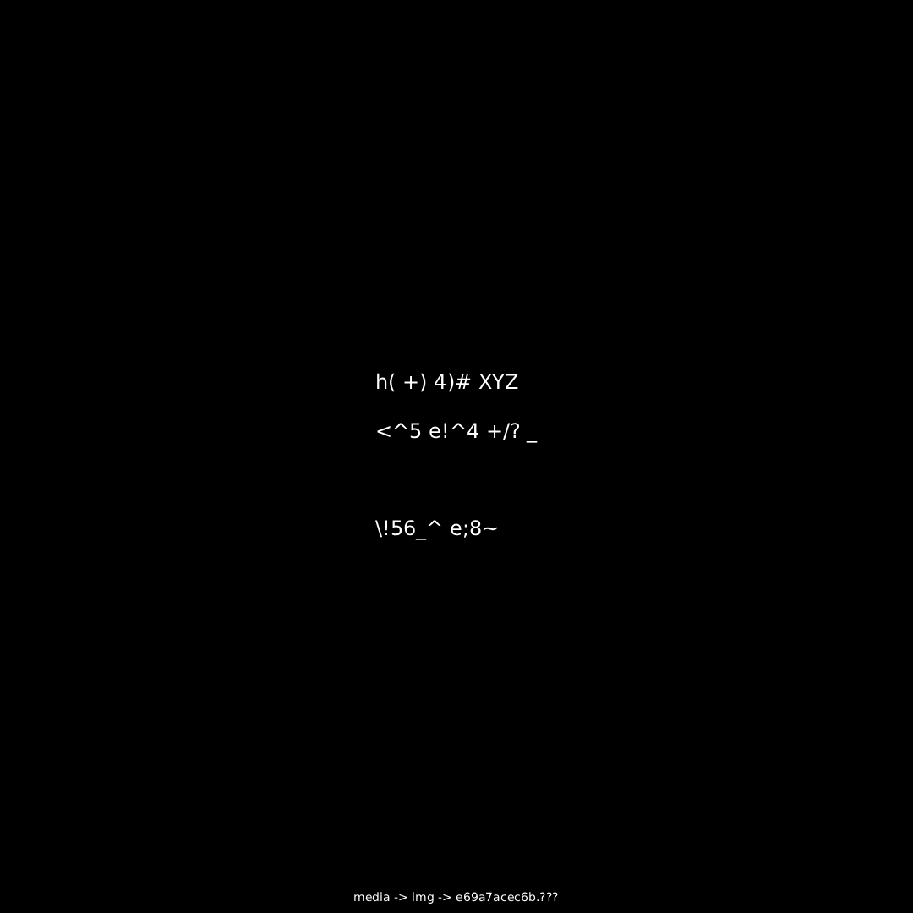
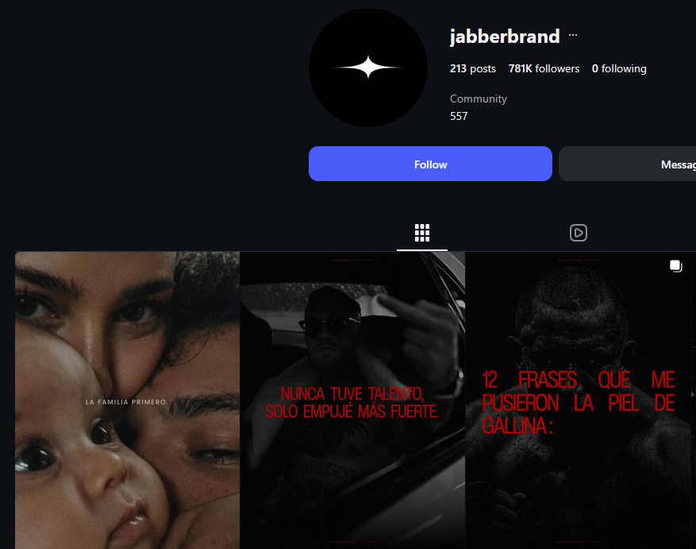
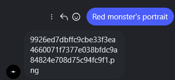
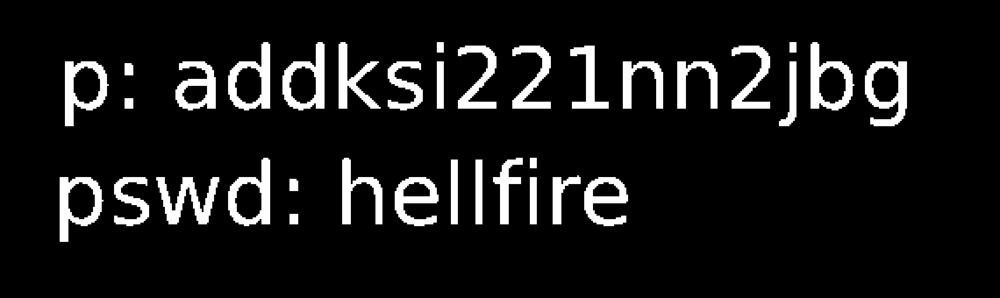

# Wallet 1 - Key 03 / Master Decryption Key

Status: solved and independently reproduced; final validation not submitted

Primary clue: `Clues/Clue-1.jpg`

## Master Decryption Key

```text
85e1a27c079ad4e6a142136d23cd23391a60eea05820fa143cf27948c9545ece
```

This is the final Wallet 1 master input, not a third independently validated
fragment and not the server-returned wallet private key.

## Short Chain

```text
Clue-1.jpg
-> final official X image
-> media -> img -> e69a7acec6b.???
-> canonical media-host JPEG
-> EXIF XPComment homophonic table
-> GO TO DOT XYZ / AND FIND THE / HIDDEN FILE
-> cicada3301.xyz/hidden.txt
-> positions 50-56 and a Base64 phone number
-> (833) 237-8298
-> phone message: "family first"
-> Jabberbrand post: LA FAMILIA PRIMERO
-> caption words 50 through 56
-> ASK ME FOR THE RED MONSTER'S PORTRAIT
-> DM-delivered PNG filename
-> portrait on media.cicada3301.net
-> red-channel least-significant bit
-> p: addksi221nn2jbg / pswd: hellfire
-> 3618803301.xyz/addksi221nn2jbg
-> PBKDF2-SHA256 and AES-256-GCM
-> master decryption key
```

## Step 1 - Inspect The Final X Clue

The final Wallet 1 clue was released at:

```text
https://x.com/3301coin/status/2074825815770923076
```

Post text:

```text
Last clue for wallet 1
good luck.
3301_
```

The attached image is preserved as:

```text
Wallet-1/Key_03/Clues/Clue-1.jpg
```



Three lines of symbols appeared in the center. The footer supplied the first
concrete navigation instruction:

```text
media -> img -> e69a7acec6b.???
```

The stem is `e69a7acec6b`, including the second `c` before `6b`.

Why it mattered:

The footer matched the already established media-host route grammar and gave a
specific object name. The unknown extension was the only missing URL component.

## Step 2 - Recover The Canonical JPEG

Testing the image extension on the known media host produced:

```text
https://media.cicada3301.net/img/e69a7acec6b.jpg
```

The canonical artifact is preserved at:

```text
Wallet-1/Key_03/Assets/e69a7acec6b.jpg
```

Expected properties:

```text
Dimensions: 1080x1080
Format: JPEG
SHA-256: 778f1ef7c3a939f7724394162aee9d599113e2e4cfe2fac926534d81a7c7c8dd
```


The X-hosted JPEG and the canonical JPEG render the same RGB pixels, but their
file hashes differ. The X copy is metadata-stripped; the media-host copy retains
the decisive EXIF data.

Why it mattered:

This explains why inspecting only the X rendition could not reveal the cipher
key. The footer pointed back to the metadata-bearing original.

## Step 3 - Extract The XPComment Key

The canonical JPEG contains an EXIF `XPComment` value. Reproduction from the
repository root:

```powershell
@'
from PIL import Image

im = Image.open("Wallet-1/Key_03/Assets/e69a7acec6b.jpg")
raw = im.getexif().get(0x9C9C)
print(raw.decode("utf-16le").rstrip("\0"))
'@ | python -
```

The comment defines a homophonic substitution table:

```text
E  - = _ ~
T  + * # &
A  < > [ ]
O  ( ) { }
I  ! | : ;
N  ^ ' " `
S  $ % @
R  1 2 3
D  4 5 6
L  7 8 9
C  0 ,
U  .
B  m n
M  a b
W  c d
F  e f
G  g h
P  k l
V  o
K  p
J  q
Q  s
```

Multiple symbols can represent the same plaintext letter, which is why the
three visible lines do not resemble a simple one-symbol-per-letter substitution.

Why it mattered:

The image carried its own decoding key. No external cipher family or guessed
alphabet was required.

## Step 4 - Decode The Homophonic Message

Visible cipher text:

```text
h( +) 4)# XYZ
<^5 e!^4 +/? _
\!56_^ e;8~
```

The spaced `_` at the end of line two is the terminal cursor, not part of the
sentence. The image uses `/`, `\`, and `?`, which are omitted from the metadata
table. Sentence structure recovers them as `/ -> H`, `\ -> H`, and `? -> E`
without changing any defined mapping.

Reproduction:

```powershell
python tools\wallet1_key03_extract.py `
  --lsb-output "$env:TEMP\wallet1-key03-red-lsb.png"
```

Relevant output:

```text
key_03_message=GO TO DOT XYZ / AND FIND THE / HIDDEN FILE
```

Decoded message:

```text
GO TO DOT XYZ
AND FIND THE
HIDDEN FILE
```

Why it mattered:

The main message supplied the `.xyz` destination and the next artifact type.

## Step 5 - Find The `.xyz` Hidden File

`GO TO DOT XYZ` pointed to:

```text
https://cicada3301.xyz/
```

The instruction to find the hidden file resolved at:

```text
https://cicada3301.xyz/hidden.txt
```

A byte-for-byte capture is preserved as [hidden.txt](Assets/hidden.txt). Its two
non-empty payload lines are:

```text
50-51-52-53-54-55-56
KDgzMykgMjM3LTgyOTg=
```

Expected artifact hash:

```text
SHA-256: 9df1a42b23e49a263524ff46d78f34f38e0e76455ae13e4018623ceffa6e2d2f
```

Why it mattered:

The first line supplied seven positions. The second supplied the next contact
point in an explicitly encoded form.

## Step 6 - Decode And Call The Phone Number

Base64 input:

```text
KDgzMykgMjM3LTgyOTg=
```

Reproduction:

```powershell
[Text.Encoding]::UTF8.GetString(
  [Convert]::FromBase64String("KDgzMykgMjM3LTgyOTg=")
)
```

Output:

```text
(833) 237-8298
```

The phone recording's actionable phrase was:

```text
They say "family first", or something.
```

Why it mattered:

The phone did not provide another number transform. It pointed back to a family
reference already visible on a social clue surface.

## Step 7 - Find The "Family First" Instagram Post

The established Jabberbrand Instagram account had a post whose image said:

```text
LA FAMILIA PRIMERO.
```

That literally translates to:

```text
THE FAMILY FIRST.
```



The post caption read:

```text
At dawn the caretaker wandered through abandoned corridors where faded murals
watched silent visitors and dust drifted beneath cracked arches. Beyond the
library a scholar recorded strange rumors about distant beasts forgotten by
time. Some accounts were contradictory while others seemed unsettlingly
precise. If you seek the next clue ask me for the red monster's portrait today.
3301
```

Why it mattered:

The Spanish image gave an exact match for the phone phrase, while the unusually
constructed caption provided text long enough for the seven positions from
`hidden.txt`.

## Step 8 - Apply The Hidden Word Positions

Use normal one-based word indexing, keep `monster's` as one word, and exclude
the `3301` signature.

Reproduction:

```powershell
@'
import re

caption = (
    "At dawn the caretaker wandered through abandoned corridors where faded murals "
    "watched silent visitors and dust drifted beneath cracked arches. Beyond the "
    "library a scholar recorded strange rumors about distant beasts forgotten by time. "
    "Some accounts were contradictory while others seemed unsettlingly precise. "
    "If you seek the next clue ask me for the red monster's portrait today."
)

words = re.findall(r"[A-Za-z]+(?:'[A-Za-z]+)?", caption)
selected = [(index, words[index - 1]) for index in range(50, 57)]

print(selected)
print(" ".join(word for _, word in selected))
print("word 57:", words[56])
'@ | python -
```

Output:

```text
[(50, 'ask'), (51, 'me'), (52, 'for'), (53, 'the'),
 (54, 'red'), (55, "monster's"), (56, 'portrait')]

ask me for the red monster's portrait
word 57: today
```

Exact instruction:

```text
ASK ME FOR THE RED MONSTER'S PORTRAIT
```

The `today` control matters: zero-based indexing or including an extra token
does not produce the exact seven-word DM request.

Why it mattered:

The positions were caption word coordinates, not ASCII values, arithmetic, or a
transform on the phone number.

## Step 9 - Request The Red Monster's Portrait

The exact phrase was sent to Jabberbrand:

```text
Red monster's portrait
```

The account responded with:

```text
9926ed7dbffc9cbe33f3ea4660071f7377e038bfdc9a84824e708d75c94fc9f1.png
```



The response wrapped across lines in the message UI, but the filename is one
continuous 64-hex stem followed by `.png`.

Why it mattered:

This was direct provenance for the next media object. The filename was not a
hash to crack; it was an object identifier to locate.

## Step 10 - Locate The Hash-Named Portrait

The earlier media route established the complete URL:

```text
https://media.cicada3301.net/img/9926ed7dbffc9cbe33f3ea4660071f7377e038bfdc9a84824e708d75c94fc9f1.png
```

The exact file is preserved as:

```text
Wallet-1/Key_03/Assets/red-monster.png
```

Expected properties:

```text
Dimensions: 1080x1080
Format: PNG, 8-bit RGB
Size: 310625 bytes
SHA-256: aef260473a646f9bba1c0110892ccd77f8b4e05c3c64820d0d4bf6b8694f60f0
Chunks: IHDR, IDAT, IEND only
```


The PNG has no text chunk, EXIF record, bytes after `IEND`, or embedded archive.
The useful signal is in its pixel values.

Why it mattered:

The lack of metadata narrowed the next check to image channels and bit planes.

## Step 11 - Extract The Red-Channel LSB

Extract bit zero from every red-channel value:

```powershell
python tools\wallet1_key03_extract.py `
  --lsb-output "$env:TEMP\wallet1-key03-red-lsb.png"
```

Expected diagnostics:

```text
key_03_portrait_sha256=aef260473a646f9bba1c0110892ccd77f8b4e05c3c64820d0d4bf6b8694f60f0
key_03_red_lsb_one_bits=8613
key_03_red_lsb_bbox=224,574,706,687
```

The readable crop is preserved here:



For display, that preview crops the full 1080-by-1080 bitplane at
`(left=190, top=550, right=760, bottom=720)` and enlarges it by `4x` with
nearest-neighbor resampling. The diagnostic bounding box above is calculated
from the uncropped plane.

It reads exactly:

```text
p: addksi221nn2jbg
pswd: hellfire
```

Everything is lowercase. The character after `22` is digit `1`, not lowercase
`l`; the numeral has a distinct cap and foot, unlike the two `l` glyphs in
`hellfire`.

Why it mattered:

This supplied both a short page/path identifier and its password. The clean
two-line bitplane, with the portrait's other red values forced even, makes the
payload intentional.

## Step 12 - Use The Hidden Page Path And Password

Keys 01 and 02 had already established the standalone password host:

```text
https://3618803301.xyz/
```

Use the `p:` value as a direct page/path slug:

```text
https://3618803301.xyz/addksi221nn2jbg
```

Do not prepend another route segment. The `p:` label identifies the value as a
page/path slug; it does not name a `/p/` directory.

The exact direct path serves a distinct password page with one `CIPHER` value.
A random 15-character path returns the older root page instead, which is a useful
control showing that the discovered slug is deliberate.

Password:

```text
hellfire
```

Why it mattered:

The chain reused the same password-page infrastructure as the first two keys,
but placed the final payload at a new direct path.

## Step 13 - Decrypt The Final Page Payload

The path page embeds this Base64 ciphertext:

```text
0xL7HhrWqlMod5DxwmDdz4QpM13Sbi7guZ0owDVeY439wEeelI6hm8xL2OVjCBE+AZyVoYq5CgnkveqE2UlJnZQx/J9+71InxO1wXfUWsxZZ0CQn54em79EQw0MddQ/jW15TGRwSFuZ5ZT45
```

Because `hellfire` is a passphrase rather than a 64-hex raw key, the page uses:

```text
PBKDF2-HMAC-SHA256
100000 iterations
32-byte derived key
AES-256-GCM
```

Payload layout:

```text
first 16 bytes: salt
next 12 bytes: IV
middle bytes: ciphertext
last 16 bytes: authentication tag
```

Reproduction:

```powershell
@'
const crypto = require("crypto");

const cipherB64 =
  "0xL7HhrWqlMod5DxwmDdz4QpM13Sbi7guZ0owDVeY439wEeelI6hm8xL2OVjCBE+" +
  "AZyVoYq5CgnkveqE2UlJnZQx/J9+71InxO1wXfUWsxZZ0CQn54em79EQw0MddQ/" +
  "jW15TGRwSFuZ5ZT45";

const combined = Buffer.from(cipherB64, "base64");
const salt = combined.subarray(0, 16);
const iv = combined.subarray(16, 28);
const encryptedWithTag = combined.subarray(28);
const ciphertext = encryptedWithTag.subarray(0, encryptedWithTag.length - 16);
const tag = encryptedWithTag.subarray(encryptedWithTag.length - 16);

const key = crypto.pbkdf2Sync("hellfire", salt, 100000, 32, "sha256");
const decipher = crypto.createDecipheriv("aes-256-gcm", key, iv);
decipher.setAuthTag(tag);

const plaintext = Buffer.concat([
  decipher.update(ciphertext),
  decipher.final(),
]).toString("utf8");

console.log("salt:", salt.toString("hex"));
console.log("iv:", iv.toString("hex"));
console.log("tag:", tag.toString("hex"));
console.log("plaintext:", plaintext);
'@ | node -
```

Expected output:

```text
salt: d312fb1e1ad6aa53287790f1c260ddcf
iv: 8429335dd26e2ee0b99d28c0
tag: 1d750fe35b5e53191c1216e679653e39
plaintext: 85e1a27c079ad4e6a142136d23cd23391a60eea05820fa143cf27948c9545ece
```

Why it mattered:

Authenticated decryption succeeded and returned one clean 64-hex value. That is
the exact shape expected by the final `MASTER DECRYPTION KEY` field.

## Step 14 - Confirm The Final Validation Contract

The official Wallet I frontend exposes two fragment slots and one separate
master field:

```text
KEY_01
KEY_02
MASTER DECRYPTION KEY
```

For Wallet I, `total_hints` is `3`. The frontend calculates the independently
validated fragment count as `total_hints - 1`, which is `2`, and constructs the
final request in this order:

```text
[KEY_01, KEY_02, MASTER DECRYPTION KEY]
```

The new value therefore goes unchanged into:

```text
MASTER DECRYPTION KEY
```

The frontend then calls `validate_final_key`. A successful response contains a
separate `decryptor` value that the interface labels as the wallet private key.
That server-returned private key is not the 64-hex master input and is not
included in this repository.

No `validate_final_key` request was submitted while reproducing this walkthrough,
so no attempt was consumed and no wallet-private material was requested.

Why it mattered:

This preserves the protocol distinction: Key 03 is the final decryptor hunt and
master input, not Fragment 3. The cryptographic puzzle is solved even though the
attempt-sensitive final server action remains intentionally unperformed.
